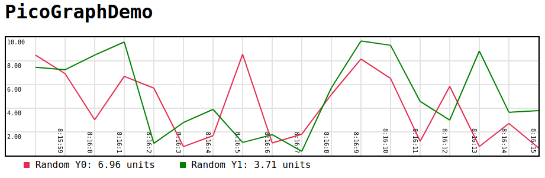

# picograph.js
Simple and tiny graphing library for javascript.

[Download picograph.js](picograph.js)

# Demo

```html
<!DOCTYPE html>
<html>
    <head>
        <title>PicoGraphDemo</title>
        <script src="picograph.js"></script>
    </head>
    <body style="font-family: Lucida Console, Monaco, monospace;">
        
        <h1>PicoGraphDemo</h1>
        
        <!-- Canvas for thr geaph -->
        <canvas id="graphDemo" width=900px height=200px 
            style="border:2px solid #000000;image-rendering: crisp-edges;">
        </canvas>
        
        <!-- div for legends/labels -->
        <div id="graphLabels"></div>

        <script>
            /* Create graph using picograph */
            var demograph = createGraph("graphDemo", ["Random Y0", "Random Y1"],
                "graphLabels", 20, 10);

            /* Update values every second */
            setInterval(updateEverySecond, 1000);

            function updateEverySecond() {
                /* Get new values */
                yrand0 = Math.random()*10;
                yrand1 = Math.random()*10;

                /* Update graph */
                demograph.update(yrand0, 0);
                demograph.update(yrand1, 1)
            }

        </script>
    </body>
</html>
```

# Documentation
[Download picograph.js](picograph.js)
```javascript
createGraph(canvasId, labels, labelDivId, intervalSize, maxVal, scalesteps=5)
```
**Arguments** :

+ **canvasId** : The id of `<canvas>` tag for the graph.
+ **Labels** : List/array of string for label names.
+ **labelDivId**: ID of the `<div>` tag to place graph labels/legend.
+ **intervalSize**: Amount to shift the graph on update.
+ **maxVal**: Approximate maximum value. Picograph can autoscale, this 
argument is only for initial value.
+ **scalesteps**: Number of scale lines to draw on the graph.

**Returns** : `Graph` object.

```javascript
Graph.update(yval, labelID)
```
**Arguments** :

+ **yval** : New value to plot.
+ **labelID** : The index of the label to add the point to 
(in `Labels` argument in `createGraph`).
